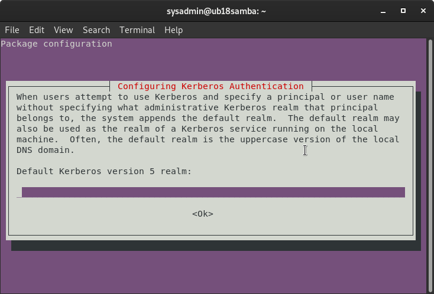

# Paket ile Kurulum

Elinizde bulunan "**samba-20201113-082908.deb**" veya tam sürümün yer aldığı deb paketini daha önce kurmuş olduğunuz işletim sistemi üzerine göndermeniz gerekmektedir.


Sambayı debian tabanlı işletim sistemine kurmadan önce, daha önce samba kurulmadığından emin olunmalıdır. Bazı dağıtımlar kurulum sırasında depodan samba depodan samba kurmaktadır. Bunu engellemek için sunucuların minimal versiyonları ile kurulum yapılabilir, ya da kurulacak servisler arasından samba kaldırılabilir.

İşletim sisteminde samba kurulu olup olmadığını aşağıdaki komut ile kontrol edebilirsiniz.

```text
samba --version
# Version 4.9.5-Debian
```


## 1. DEB paketini sunucuya gönderme

### 1.a. GNU/Linux sistemden gönderme:

Kendi bilgisayarınız GNU/Linux temelli bir bilgisayar ise temin ettiğiniz deb paketini karşı sunucu üzerine aşağıdaki komut ile SSH protokolünü kullanarak gönderebilirsiniz:

```text
scp samba-paketversiyonu.deb sysadmin@sunucuipadresi:~/.
```

Bu komut kullanılırken "sysadmin" yerine sunucuya erişim sağladığınız kullanıcı adını, sunucuipadresi yerine ise kurduğunuz sunucunun IP Adresi veya DNS kaydı eklediyseniz DNS adresini yazmanız gerekmektedir. Ayrıca güncel paket kullanabilmek için paketadındaki "samba-**versiyonnumarası**.deb"'a dikkat etmek gerekmektedir.

Bu komutun çalışabilmesi için sunucunuzda openssh-server paketinin kurulu olması gerekmektedir ve varsayılanda bulunan güvenlik izinlerinin açık olması gerekmektedir.

### 1.b. Windows sistemden gönderme:

Henüz uygulanmadı. Özet olarak Winscp uygulaması ile gönderilebilmektedir.

## 2. Önceden kurulu sambayı temizleme

Depodan ya da derlenerek kurulmuş samba bağımlılıkları, derlediğimiz sambadaki bağımlılıklar ile çakışabileceğinden mevcut sambayı kaldırmak gerekmektedir. Aşağıdaki komut depodan kurulan samba kaldırılabilir. Fakat kalıntı bağımlılıklar ve dosyalar sorun yaratabileceğinden, samba kurulmamış temiz bir makine kullanılması önerilmektedir.

```text
if [[ $(samba --version 2> /dev/null) ]] && [[ $(dpkg -s sambahvl 2> /dev/null) -eq "" ]] ; then 
    echo "Depodan kurulu samba kaldırılıyor"
    sudo apt-get -y remove 'samba*[^deb]'
    sudo apt-get autoremove -y
    sudo rm -rf /etc/samba
else 
    echo "Depodan samba kurulmamis"
fi
```

## 3. DEB paketini kurma

DEB paketini gönderdikten sonra işletim sistemi bağımsız olarak uzaktan sunucuya erişmeniz gerekmektedir. Bunun için GNU/Linux üzerinden "SSH İstemcisi" ile bağlantı kurulabileceği gibi Windows üzerinden "Putty" ile giriş yapabilirsiniz.

Aşağıdaki komut ile SSH protokolü kullanarak giriş yapılır:

```text
ssh sysadmin@sunucuipadresi
```

Sunucuya giriş yaptıktan sonra yetkili kullanıcı yine aynı kullanıcı ise aşağıdaki komut ile kurulum başlatılır. Sunucunun yetkili kullanıcı olmasının dışında ilgili cihazın herhangi bir debian tabanlı depo sunucusuna erişebiliyor olması gerekmektedir. Depo sunucusuna erişim yoksa kurumsal destek alınması önerilmektedir.

```text
sudo apt install -y ./samba-20201113-082908.deb
```

Kurulum sırasında, kerberos ilk defa yükleniyorsa yapılandırmak için aşağıdaki sayfayı açmaktadır. Burada **enter**'a tıklanarak boş bırakılabilir.




