# Pardus 19 Sunucu Kurulumu

## 18 adımda Pardus 19 Kurulumu:

1. Kurulum ortamını \(DVD, USB, vb.\) yerleştirerek bilgisayarınızı yeniden başlatınız.

2. Önyükleme menüsünde bulunan “**Pardus Çalışan**” seçeneği ile kuruluma başlamadan Pardus 19’u inceleyebilirsiniz. **“Grafik Arayüz ile Kur”** seçeneği ile kuruluma başlayabilirsiniz.

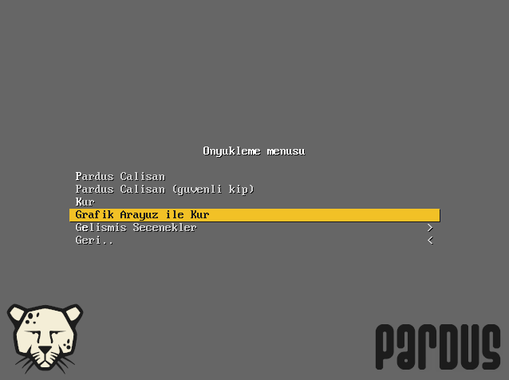

3. Dil seçimi yaparak ilerleyiniz.

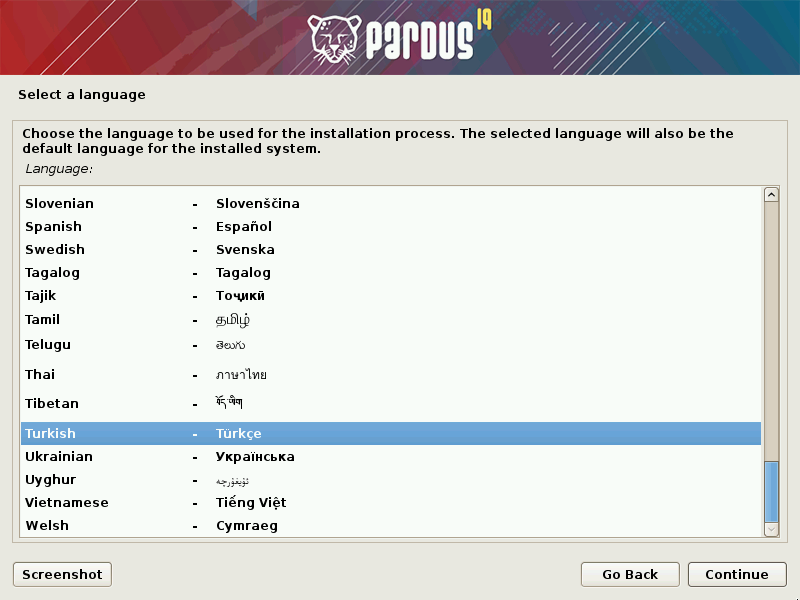

4. Konum seçimi yaparak ilerleyiniz. Bir önceki ekranda seçilen dil ayarlarına göre otomatik konum gelmektedir. “diğer” seçeneği ile farklı bir konum tanımlayabilirsiniz.

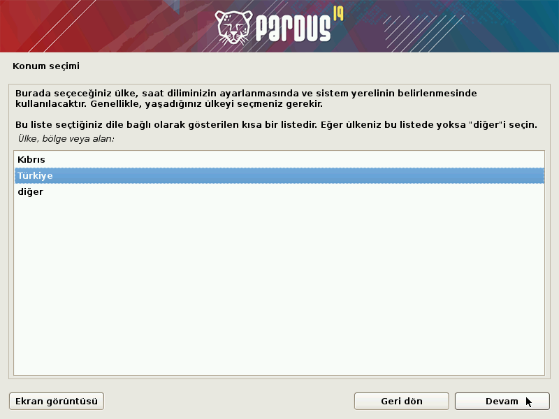

5. Kullanılacak klavye düzenini seçerek ilerleyiniz.

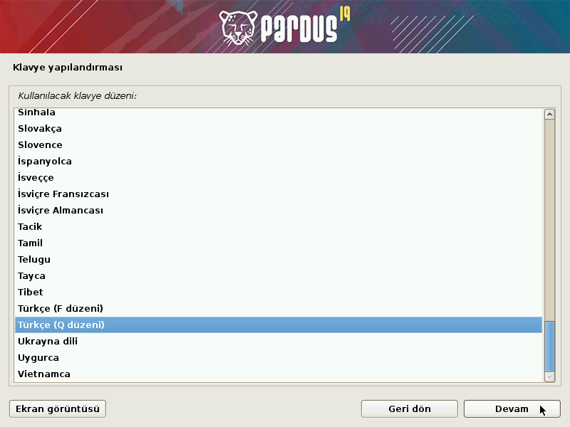

6. Ağda bilgisayarınızın adını benzersiz kılacak bir makine adı belirleyiniz.

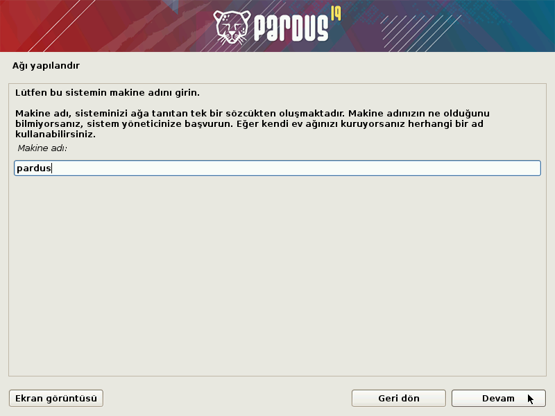

7. Etki alanı adınızı tanımlayınız, herhangi bir etki alanına dahil değilseniz veya bu konuda bilginiz yoksa boş bırakınız.

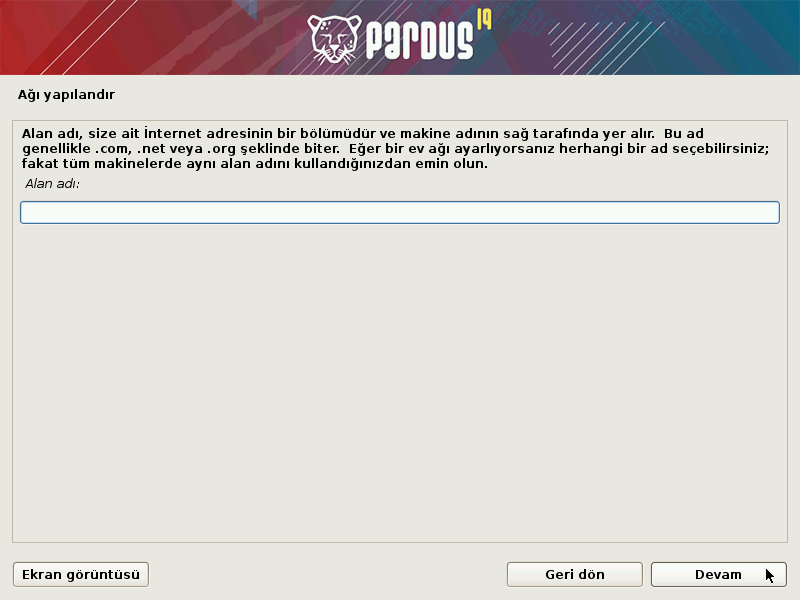

8. Kurulacak sistemdeki oluşturulacak kullanıcının tam adını giriniz.

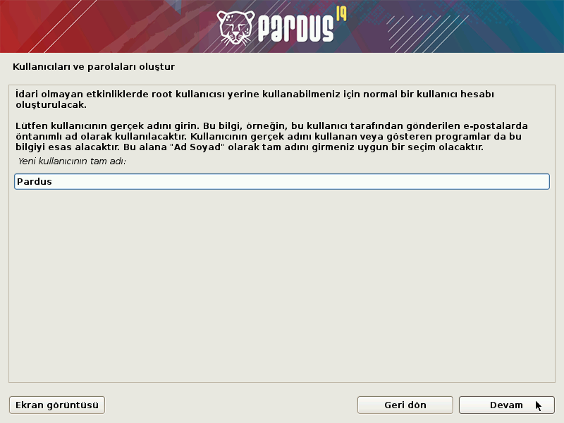

9. Yeni oluşacak hesap için kullanıcı adı belirleyiniz.

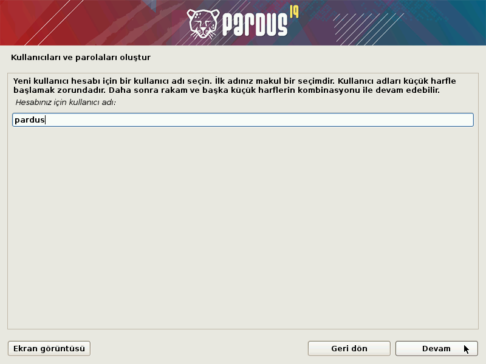

10. Tanımlanan kullanıcı için parola belirleyiniz.

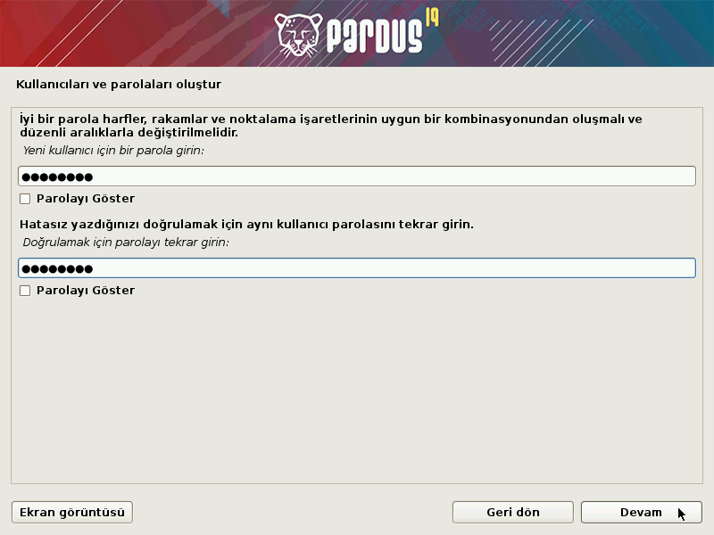

11. “Yardımcı ile – diskin tamamını kullan” seçeneği ile kurulum aracı sizin yerinize tüm bölümlemeyi yapacaktır. Seçili diski tamamen biçimlendirerek kurulum başlayacaktır.

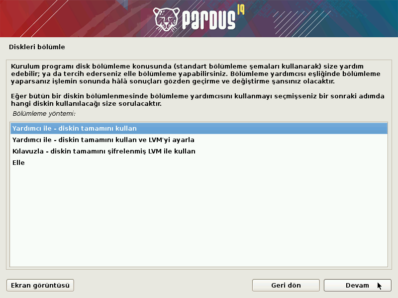

> Otomatik bölümleme haricinde bir disk tanımlaması için “Elle” seçeneğini kullanabilirsiniz. Bu seçenek ile işletim sistemi için gerekli tüm bölümleri elle oluşturmanız gerektiğini unutmayınız.

12. Kurulum yapılacak diski seçerek ilerleyiniz.

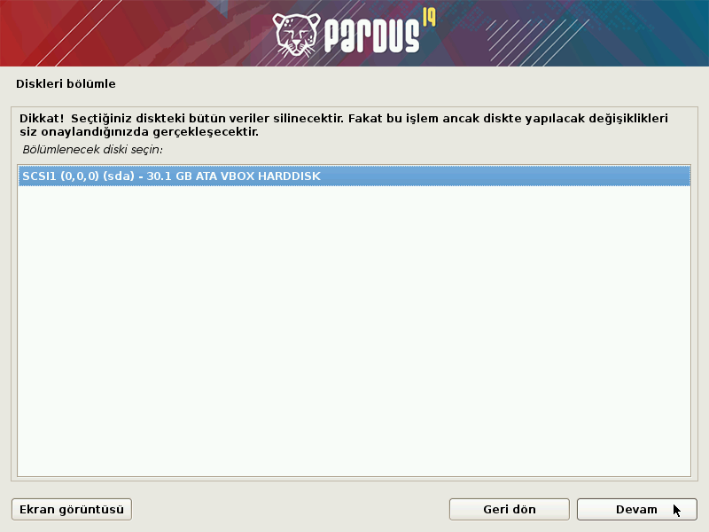

13. Disk bölümleme yapısını seçerek ilerleyiniz. Tüm dosyaların tek bölümde kurulması önerilmektedir.

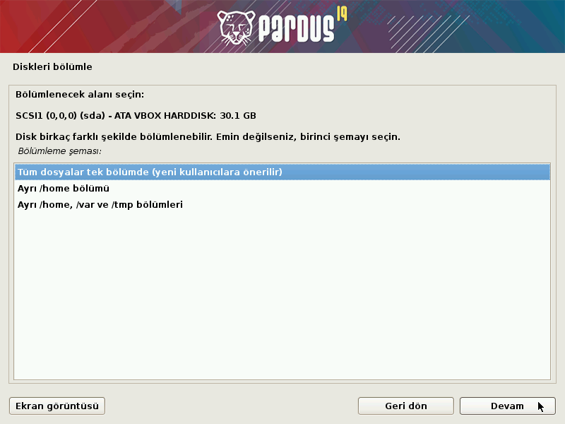

14. Seçimler sonucunda oluşan yapıya onay vererek ilerleyiniz.

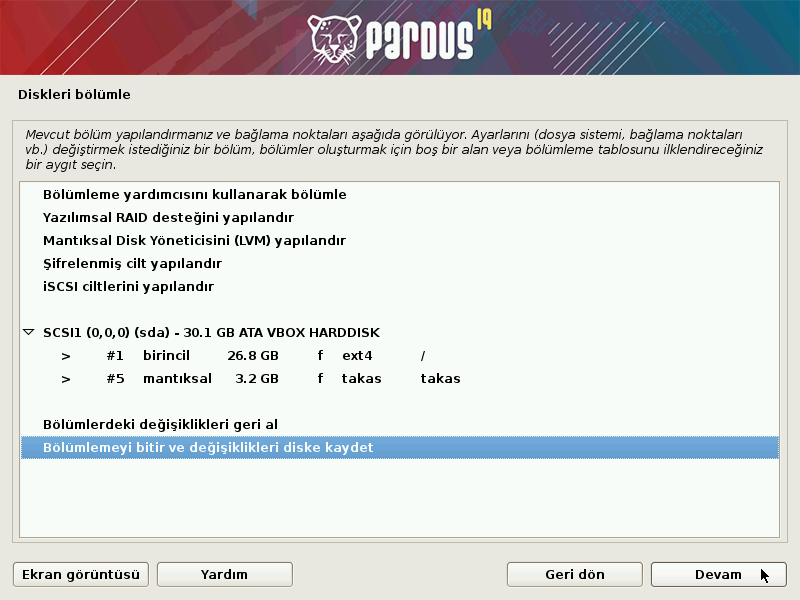

15. Değişiklikleri kaydederek ilerleyiniz.

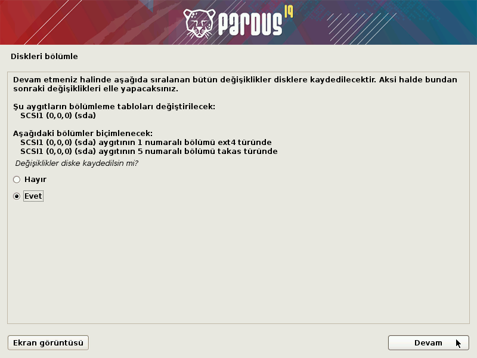

16. Pardus önyükleyicisinin kurulumu için onay vererek ilerleyiniz. Bu işlem sonrasında Pardus kendi önyükleyicisini kuracak, daha önce kurulu olan sistemleri okuyarak açılış ekranında seçiminize sunacaktır.

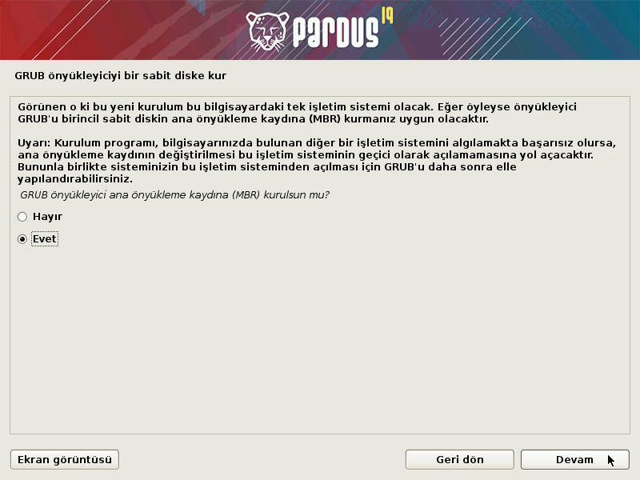

17. Grub önyükleyicisinin kurulacağı diski seçiniz.

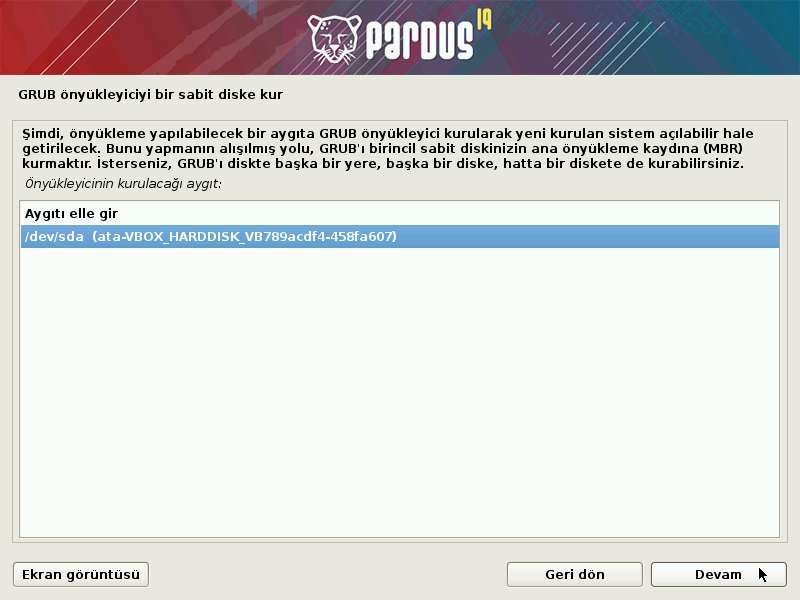

18. KURULUM TAMAMLANDI!

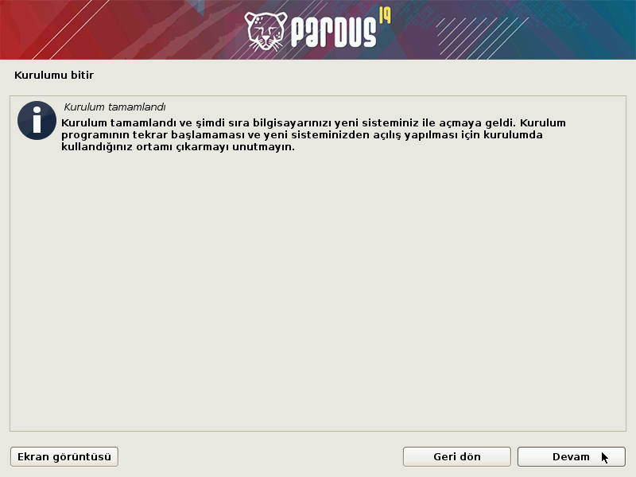

> Bu aşamadan sonra kurulum ortamını \(DVD, USB, vb.\) cihazınızdan çıkarmayı unutmayınız.

