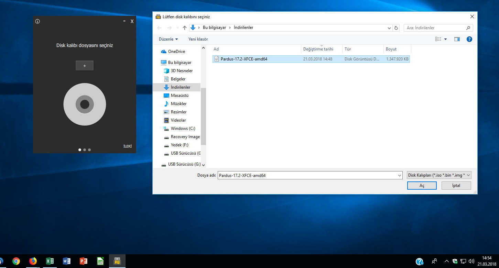
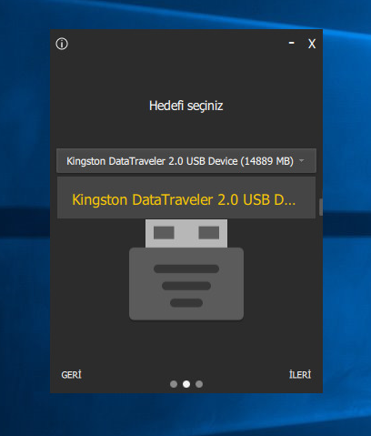
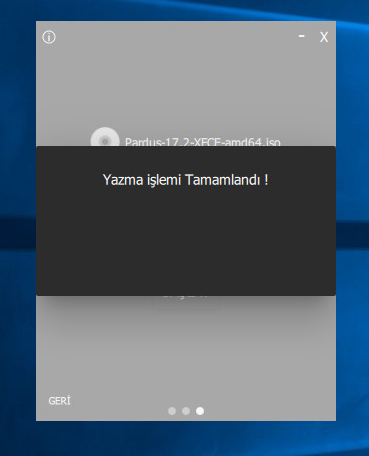

# USB ile Başlatma

USB ile İşletim Sistemi kurabilmek için kurulum ISO disk imajına ve Disk Kalıbı Yazıcı uygulamaya ihtiyaç vardır.

## 1. ISO Kalıbı İndirme

ISO kalıbı olarak hangi işletim sistemi üzerine kurulum yapacaksanız ilgili ISO kalıbı indirilmesi gerekiyor. Bunun için Pardus ve Ubuntu alternatifleri burada anlatılacaktır.

### 1.a. Pardus ISO kalıbını indirme

Aşağıdaki adreste bulunan sürümlerden güncel olan **Pardus 19.x Sunucu \(64-bit\)** sürümü bilgisayarınıza indirilir.

### 1.b. Ubuntu ISO kalıbını indirme

Aşağıdaki adreste bulunan sürümlerden güncel olan Ubuntu Sunucu sürümü bilgisayarınıza indirilir.

## 2.a. Windows üzerinde ISO Kalıbı yazdırma

Pardus Disk Kalıbı Yazıcı programını [buradan](http://indir.pardus.org.tr/PARDUS/piw.zip) tıklayarak indirin. İndirdiğiniz ZIP dosyasının içeriğini çıkartın ve **piw.exe** yi yönetici olarak onaylayarak çalıştırın.

1. USB cihazınızla önyükleme yapmak istediğiniz herhangi bir Linux disk kalıbı dosyasını \(+\) düğmesine tıklayarak seçiniz. Seçiminizi yaptıktan sonra ileri düğmesine tıklayarak veya sola kaydırma hareketi ile bir sonraki adıma geçiniz.

1. Bilgisayarınıza takılı olan \(Program otomatik tespit ederek listeler\) cihazlardan istediğinizi hedef olarak seçiniz. Seçiminizi yaptıktan sonra ileri düğmesine tıklayarak veya sola kaydırma hareketi ile bir sonraki adıma geçiniz.

1. Listelenen disk kalıbı ve hedef cihaz teyit ettikten sonra "BAŞLAT" düğmesine basınız. Yazma işleminin başlaması için gelen uyarıyı "EVET" diyerek onaylayınız.
2. Yazma işlemi başladıktan sonra dilerseniz iptal edip disk kalıbınızı veya hedef cihazınızı değiştirerek tekrar başlatabilirsiniz.
3. Yazma işlemi bittikten sonra "Yazma işlemi Tamamlandı !" yazısı ile birlikte, önyüklenebilir Linux USB ortamınız artık hazır, çıkartıp kullanabilirsiniz.

Kaynak: [https://www.pardus.org.tr/pardus-usb-olusturma/](https://www.pardus.org.tr/pardus-usb-olusturma/)

