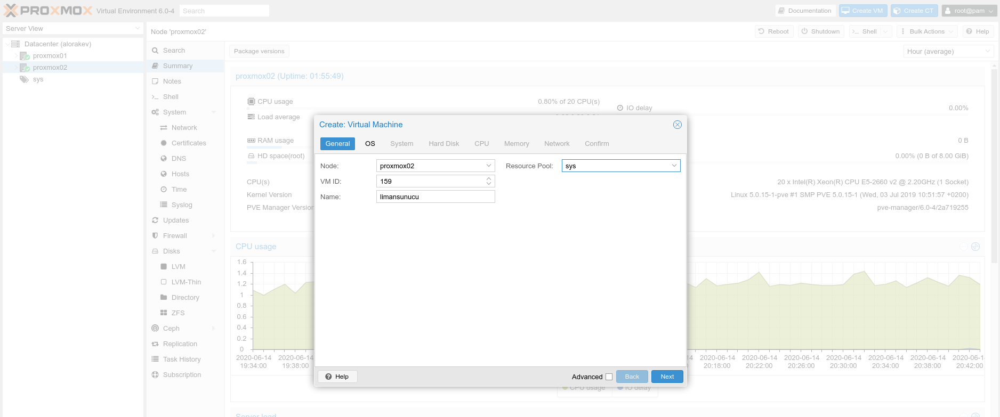
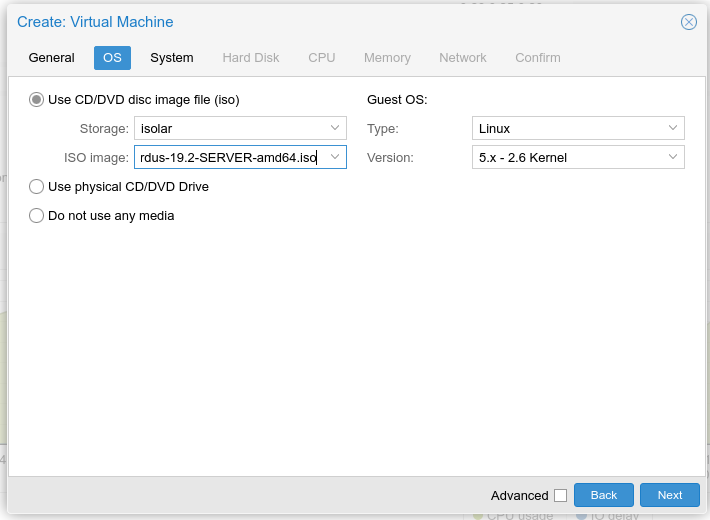
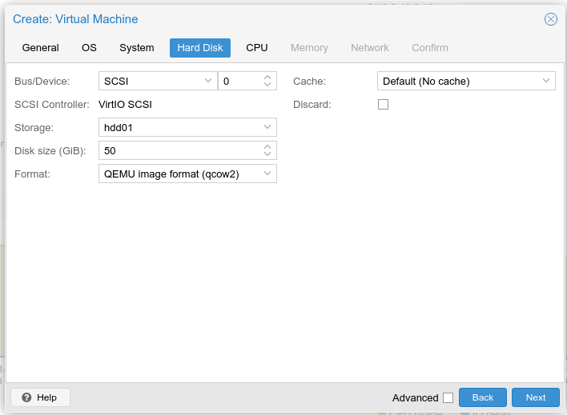
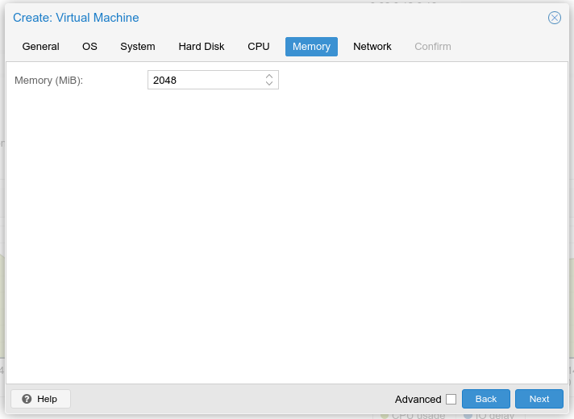
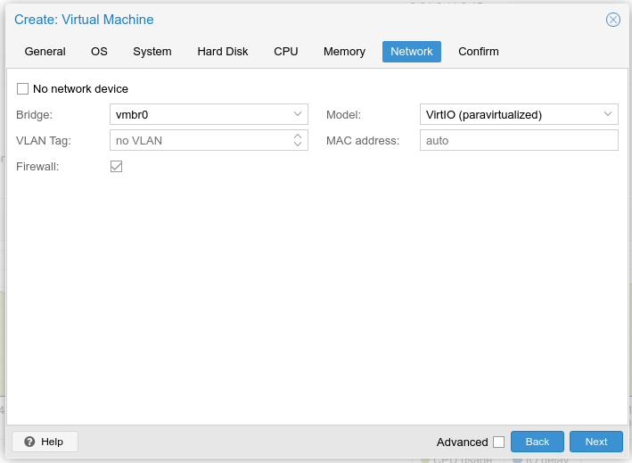
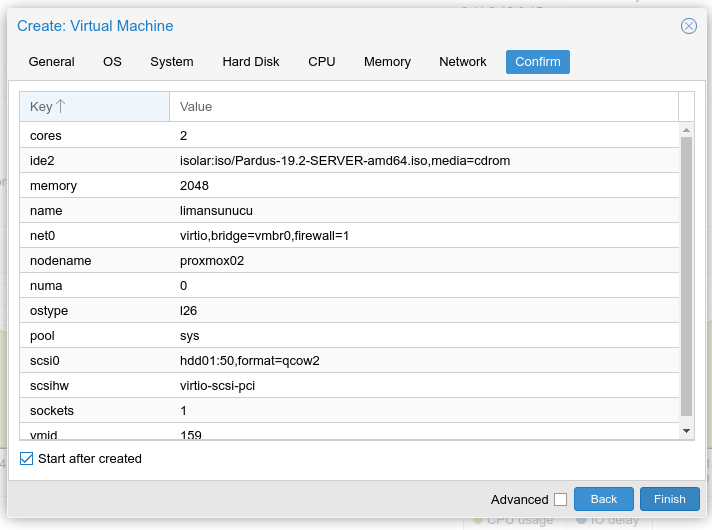

# Proxmox üzerinde USB başlatma

1. Kurulu bir Proxmox ortamınız bulunmakta ise Depolama birimine ISO'yu yüklediyseniz, Proxmox arayüzünden "Create VM" butonuna tıklayarak yeni bir sanal makine oluşturmaya başlabilirsiniz. Anlaşılır bir isim vererek bir sonraki adıma geçebilirsiniz.

2. OS \(İşletim Sistemi\) sekmesinde CD aygıtı olarak depolama alanına yüklediğiniz ISO'yu seçmeniz gerekmektedir.

3. Sistem sekmesinde herhangi bir değişiklik yapmadan ilerleyebilirsiniz. 

4. Hard Disk sekmesinde ise hangi depolama alanına kurulum yapacaksanız o kısmı seçmeniz gerekmekte ve yaklaşık 50 GB'lık bir disk boyutu seçebilirsiniz.

5. CPU sekmesinde 1 soket, 2 core seçerek ilerleyebilirsiniz.

5. Hafıza sekmesinde 2048 MiB değeri seçip ilerleyebilirsiniz.

6. Ağ sekmesinde de mevcut durumdaki ile aynı şekilde ilerleyebilirsiniz.

7. Son olarak onaylama sekmesinde özet bilgileri inceleyerek alttaki "Start after created"'i işaretleyerek oluşumdan sonra açılmasını sağlayabilirsiniz.

8. Bu adımdan sonra Proxmox üzerinde VM listesinde Sanal Makina'nızın ayağa kalktığını görebilirsiniz.

