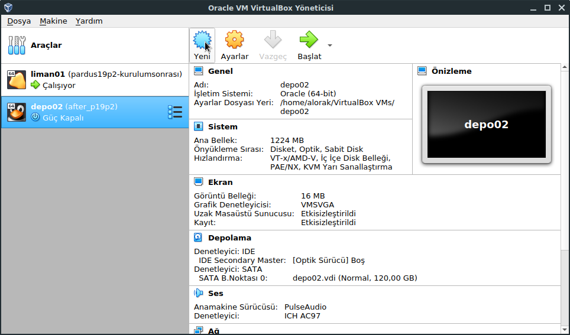
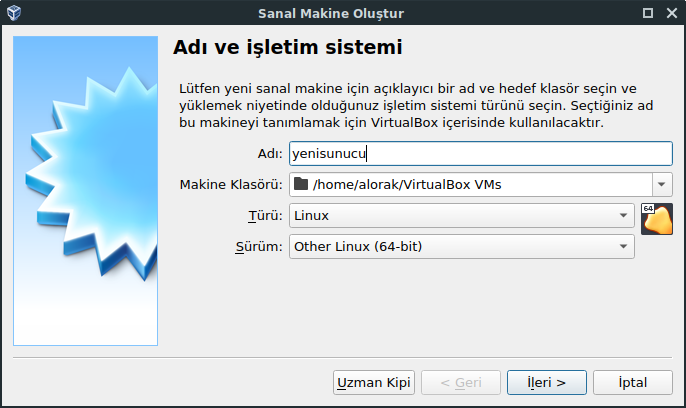
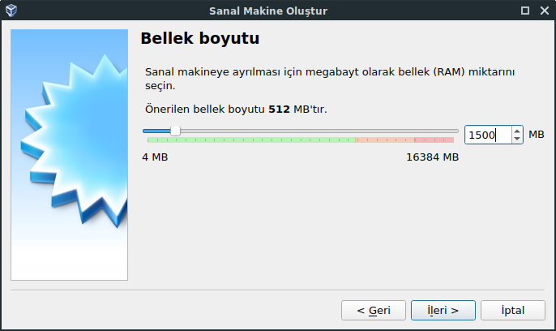
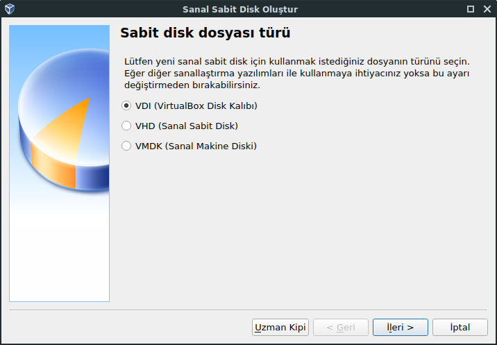
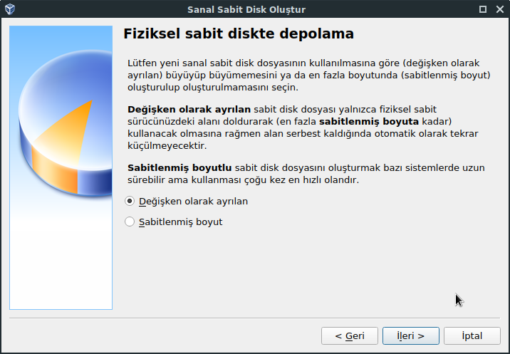
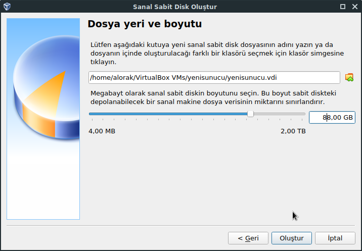
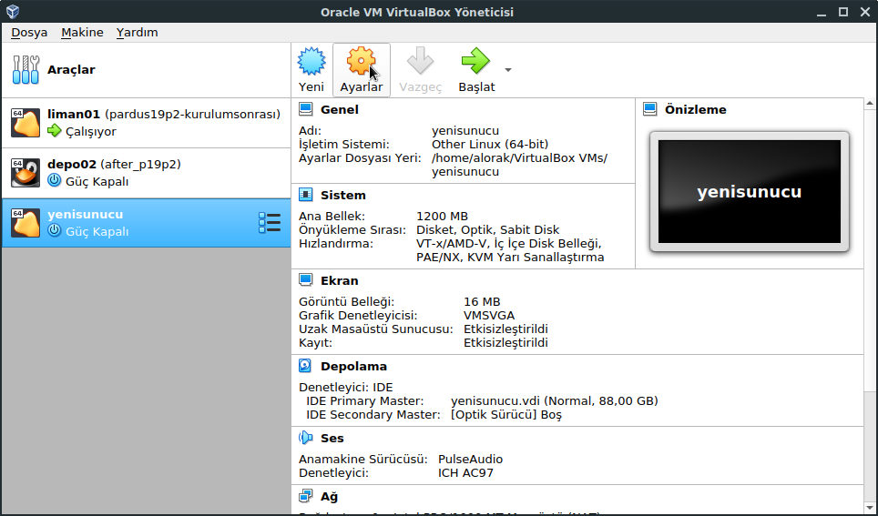
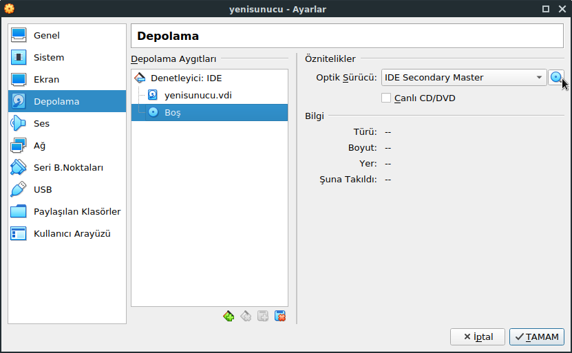
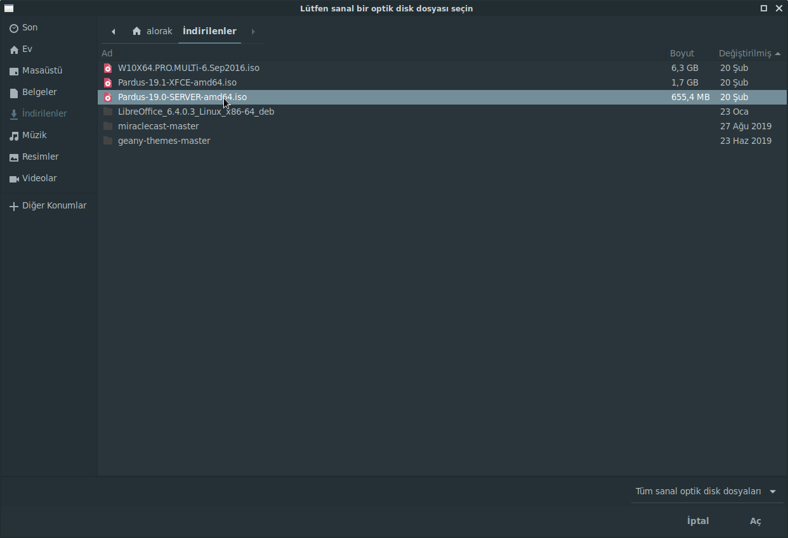
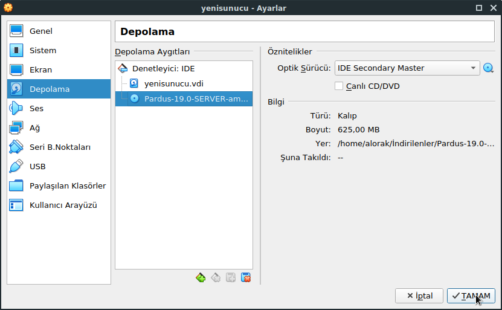

# VirtualBox üzerinde USB başlatma

Herhangi bir işletim sisteminde VirtualBox uygulamasını açmanız ve uygulama açıldıktan sonra aşağıdaki gibi yeni bir Sanal Makine oluşturma ikonuna tıklamanız gerekmektedir. Aynı işlemi menübar'da Makine&gt;Yeni menüsüne basarak da oluşturabilirsiniz.

Yeni butonuna basıldıktan sonra sizden kendi tanımanız için gerekli bir isim, sanal makineyi hangi dizine kuracağınız bilgisi ve daha sonra "misafir eklentileri" denilen VirtualBox üzerinde ek ayarlar yapmanıza izin veren yapıyı kullanmak için işletim sistemi seçmenizi isteyecektir. Herhangi bir isim girip diğer ayarları aynı tutmanızda herhangi bir problem olmayacaktır. Fakat yazdığınız isme göre işletim sistemi otomatik tanımaya çalışacağı için "Linux&gt;Other Linux" seçmeniz uygun olacaktır.

İleri dedikten sonra sizden sanal makineniz için RAM ayırmanızı isteyecektir. Bu sistem gerçek bir ortam olmayacağı için tahminen en düşük 1300 MB olacak şekilde 2048 MB veya 4096 MB gibi değerler verebilirsiniz. Tabi ki tüm bu değerler VirtualBox'u kurduğunuz makinedeki RAM'den kullanacağı için kendi kullandığınız RAM değerine göre bir oran vermeniz gerekmektedir. Ayrıca bu ayarı sanal makine kapalı olduğu herhangi bir an ileride değiştirebilirsiniz. Makine açık ise kapattıktan sonra değiştirebileceğinizi unutmayın.

Oluşturacağınız sanal makineye bir de sanal disk eklemeniz gerekmektedir. Bunun için daha önce bir disk oluşturmadığınızı düşünerek "Şimdi sanal bir disk oluştur" seçeneğini seçmenizin uygun olacağını belirtirim. Boyutunu ise ileriki kısımlarda düzenleyebileceksiniz. Ayrıca sanal makinenize ek diskler eklemek için ileride sanal makine kapalı iken istediğiniz sayıda disk ekleyebilirsiniz.

Yeni bir sabit disk oluşturduğunuz için sanal disk türü belirlemeniz gerekmektedir. Varsayılan olarak seçili gelen VDI \(Virtualbox Disk Kalıbı\) seçebildiğiniz gibi, VHD ve VMDK gibi sanal disk türlerini seçebilirsiniz. Bu formatlar Microsoft ve VMware'in sanallaştırmada kullandığı disk imajları olarak düşünebilirsiniz. İleride risk oluştursa da vdi'dan vmdk ve vhd'ye geçiş yapabilirsiniz.

Sanal diskinizin gerçek disk üzerinde tümünün ayrılmış olarak mı yoksa arttıkça mı yer kaplayacağını seçmeniz gerekmektedir. Buradaki tercih en çok kısıtlı disk alanlarında kullanıma göre değişmektedir. Çok önemli bir sunucu ise sabitlenmiş boyut seçerek bir sonraki pencerede seçeceğiniz boyutta sanal disk alanını gerçek disk üzerinde de ayırır. Böylelikle ileride disk dolması durumunda sanal makinede problem olmasını engelleyecektir.

Sanal diskin fiziksel disk üzerinde hangi dizinde tutulacağı ve boyutunun ne kadar olacağını seçeceksiniz. Hızlı bir uygulama istiyorsanız ve fiziksel işletim sisteminizde SSD bulunuyor ise bu alanı seçmeniz daha uygun olacaktır. İşletim sistemi için minimum olarak 8 GB yer ayırmanız uygun olacaktır. Örnekte 88 GB seçilmiştir.

Bu adımdan sonra sanal makineniz temel seviyede oluşturulmuş olacaktır ve tekrar VirtualBox ana ekranına düşeceksiniz. Bu ekranda sol tarafta kendi verdiğiniz isimdeki sunucuya bastıktan sonra sağ kısımda ayarlara basabilirsiniz. Veya menübarda Makine&gt;Ayarlar kısmına basmanız gerekmektedir.

Açılan pencerede solda "Depolama" tabına giriş yaptıktan sonra CDROM işareti olan ve Boş gözüken kısma tıklayıp, sağ kısımda yine CDROM ikonuna tıklayarak sanal makinenize daha önce [Kuruluma Giriş](../../kurulum-giris.md) bölümünde anlatılan Pardus Sunucu USB kalıbını \(.ISO formatındaki\) seçmeniz gerekmektedir.

Ve sonunda aşağıdaki gibi pencerede CDROM olarak Pardus Sunucu imajının seçili olması gerekmektedir. İlgili ekranda **Tamam**'a tıklayarak sanal makine CDROM'dan başlayacak hale getirilmiştir.

Bir sonraki adımda aşağıdaki gibi pencere üzerinde solda kurduğunuz sanal makine adına tıkladıktan sonra üstte Başlat'a veya menübar üzerinden Makine&gt;Başlat'a tıklayarak [Kurulum Süreçleri](../../kurulum-surecleri/)'nde bahsedilen süreçler için sanal makinenizde kuruluma geçebilirsiniz. 

