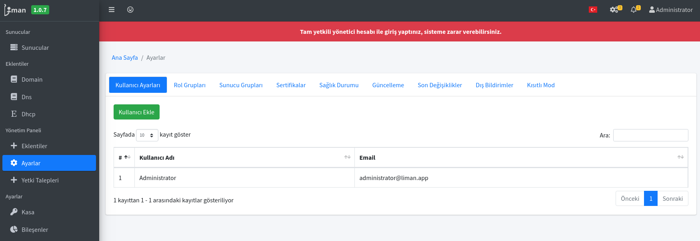
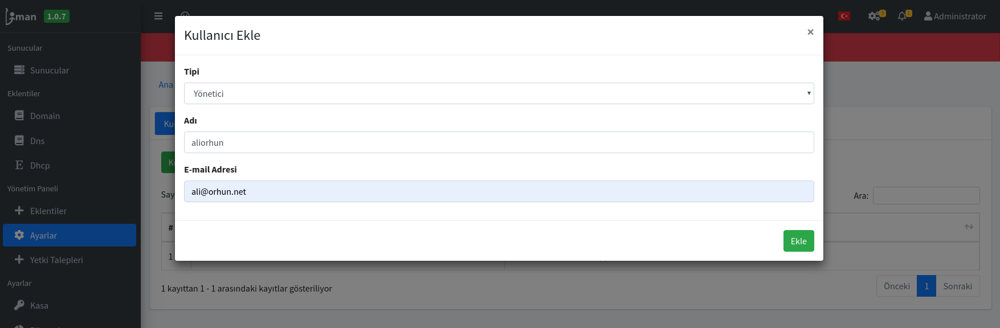
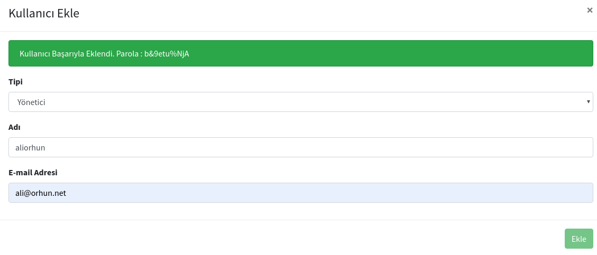
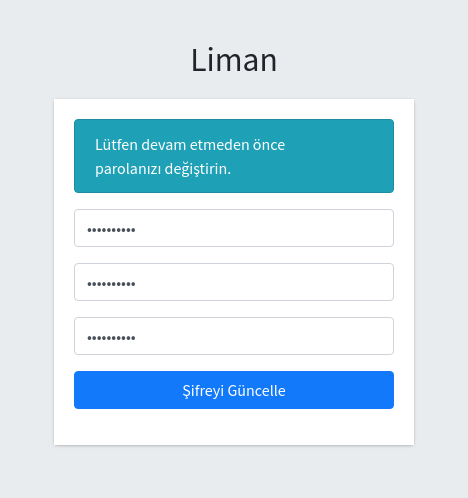
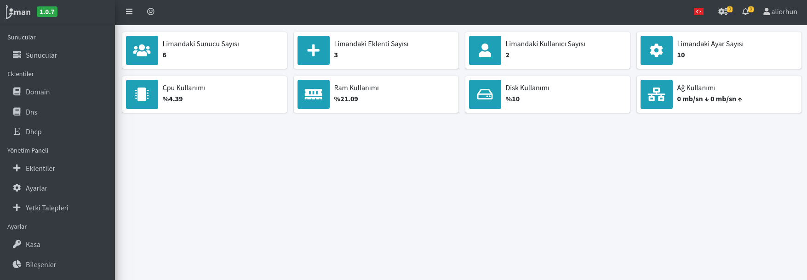

# Kurulum Sonrası Ayarlar

## 1. Yönetici kullanıcıları ekleme

Liman Kurulumunda Administrator isimli bir kullanıcı oluşturulmaktadır. Fakat bu kullanıcıyı kimlerin kullandığı bilinemeyeceği için güvenlik anlamında bir eksiklik oluşturmaktadır. Dolayısıyla Liman MYS'yi kullanacak her sistem yöneticisi kendi kullanıcı adı ile giriş yapması gerekir ki yaptıkları işlemler sonucunda sorumlu olabilsin.

1. Ayarlar sekmesine girilerek Kullanıcı ayarları kısmında "Kullanıcı Ekle" butonuna tıklanır.

2. Yetki verme seviyesine göre Tip olarak Kullanıcı veya Yönetici seçilerek bir isim ve mail adresi belirlenerek "Ekle" butonuna tıklanır.

3. Bu adımdan sonra karmaşık bir parola ile kullanıcı oluşturulur. "**b&9etu%NjA**" 

4. Bu şekilde kullanıcı eklendikten sonra mail adresi ve Parola ile kullanıcı Liman MYS üzerine giriş yapabilmektedir. İlk defa giriş yaptıktan sonra size şifre değiştirme arayüzü çıkacaktır.

5. Bu adımdan sonra tekrar giriş yaparak Liman MYS arayüzüne kendi kullanıcı hesabınız ile giriş yapabilirsiniz.

