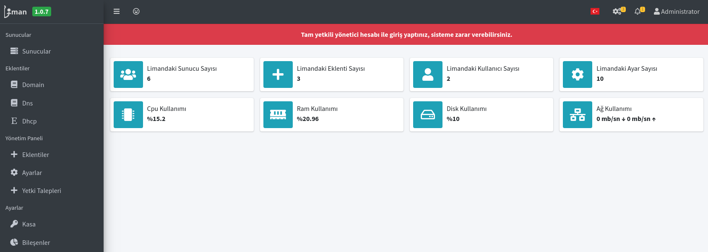

# Paket ile Kurulum

Elinizde bulunan "**liman-1.0-lastest.deb**" veya tam sürümün yer aldığı deb paketini daha önce kurmuş olduğunuz işletim sistemi üzerine göndermeniz gerekmektedir. 

## 1. DEB paketini sunucuya gönderme

### 1.a. GNU/Linux sistemden gönderme:

Kendi bilgisayarınız GNU/Linux temelli bir bilgisayar ise temin ettiğiniz deb paketini karşı sunucu üzerine aşağıdaki komut ile SSH protokolünü kullanarak gönderebilirsiniz:

```text
scp liman-1.0-lastest.deb sysadmin@sunucuipadresi:~/.
```

Bu komut kullanılırken "sysadmin" yerine sunucuya erişim sağladığınız kullanıcı adını, sunucuipadresi yerine ise kurduğunuz sunucunun IP Adresi veya DNS kaydı eklediyseniz DNS adresini yazmanız gerekmektedir. 

Bu komutun çalışabilmesi için sunucunuzda openssh-server paketinin kurulu olması gerekmektedir ve varsayılanda bulunan güvenlik izinlerinin açık olması gerekmektedir.

### 1.b. Windows sistemden gönderme:

Henüz uygulanmadı. Özet olarak Winscp uygulaması ile gönderilebilmektedir.

## 2. DEB paketini kurma

DEB paketini gönderdikten sonra işletim sistemi bağımsız olarak uzaktan sunucuya erişmeniz gerekmektedir. Bunun için GNU/Linux üzerinden "SSH İstemcisi" ile bağlantı kurulabileceği gibi Windows üzerinden "Putty" ile giriş yapabilirsiniz. 

Aşağıdaki komut ile SSH protokolü kullanarak giriş yapılır:

```text
ssh sysadmin@sunucuipadresi
```

Sunucuya giriş yaptıktan sonra yetkili kullanıcı yine aynı kullanıcı ise aşağıdaki komut ile kurulum başlatılır. Sunucunun yetkili kullanıcı olmasının dışında ilgili cihazın herhangi bir debian tabanlı depo sunucusuna erişebiliyor olması gerekmektedir. Depo sunucusuna erişim yoksa kurumsal destek alınması önerilmektedir.

```text
sudo apt install -y ./liman-1.0-lastest.deb
```

Bu kısım biraz uzun sürebilmektedir. Fakat bu adımdan sonra "Kurulum Başarıyla Tamamlandı" yazısını gördüğünüzde, kurulum işlemi tamamlanmış olacaktır.

## 3. Yönetici kullanıcısı oluşturmak

Kurulum sonrasında ilk yapılması gereken Yönetici parolası oluşturmak. Bunun için aşağıdaki komutlar ile sudo yetkili kullanıcıda iken liman kullanıcısına giriş yapılır ve yönetici hesabı oluşturulur:

```text
sudo su liman
sudo php /liman/server/artisan administrator	
```

Bu adım sonunda karşınıza liman web arayüzünden giriş yapacağınız kullanıcı adı ve parolanız çıkacaktır. Liman'ı kurduğunuz sunucunun ip adresini web tarayıcınız üzerine yazıp bu bilgiler ile giriş yaparsanız Liman'ın Web arayüzüne giriş yapmış olacaksınız.



