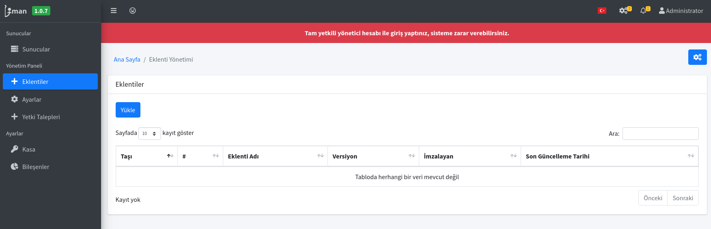
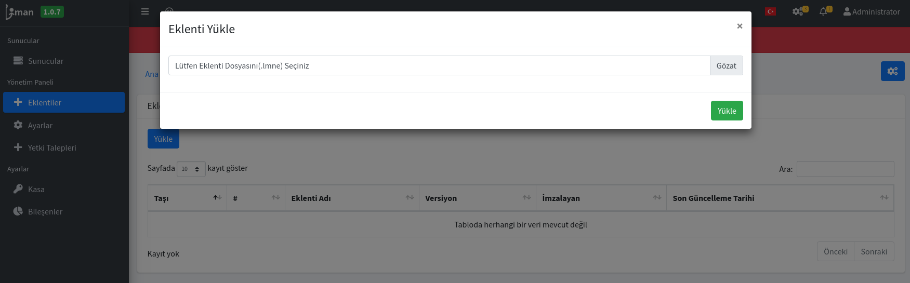
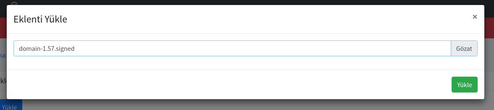
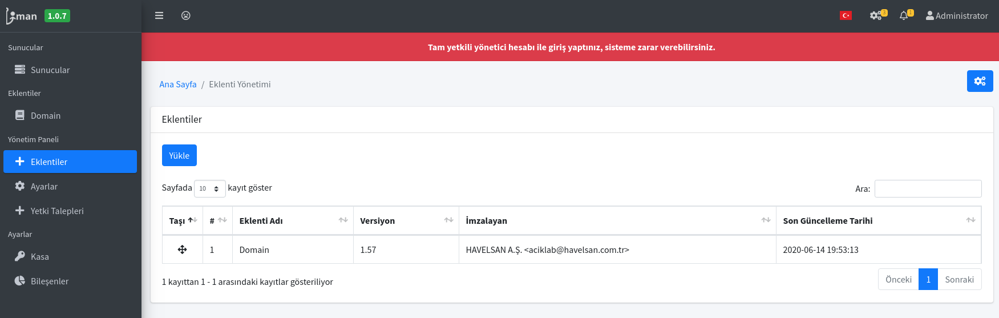

# Liman'a Eklenti Kurulumu ve Güncellenmesi

## 4 Adımda eklenti yükleme ve güncelleme

1. Yönetim panelindeki eklentiler sayfasında bulunan "Yükle" butonuna tıklayarak eklenti seçme ekranını açabilirsiniz.

2. Eklenti Yükle ekranı açıldığında "Gözat"'a tıklayarak bilgisayarınızdaki eklentiyi seçebilirsiniz.

3. Eklentiyi seçtikten sonra "Yükle" butonuna tıklayabilirsiniz..

4. Eklenti başarı ile yüklendi yazısından sonra eklentiniz HAVELSAN tarafından imzalı eklenti ise direkt olarak eklenti sayfanızda bulunacaktır.

> Bu şekilde eklentiniz sisteme eklenmiş olacaktır. Güncelleme için de aynı işlemlerin yapılması gerekmektedir. Tüm eklentileri yüklemek için bu işlemler geçerlidir.

