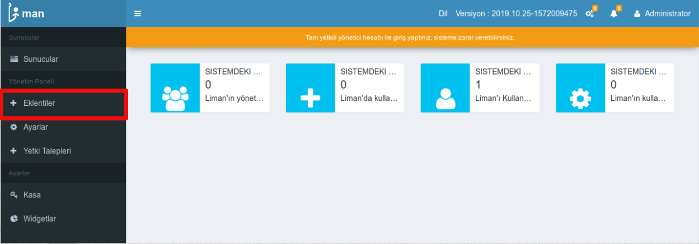
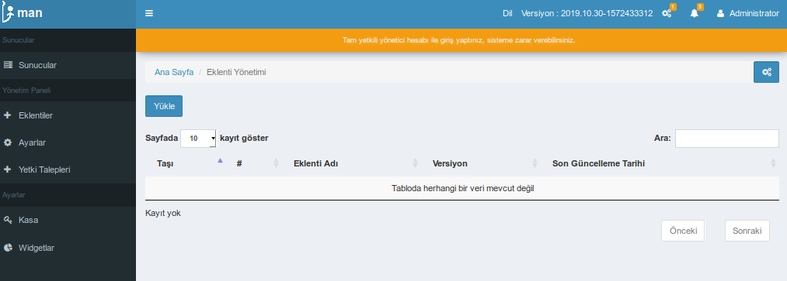
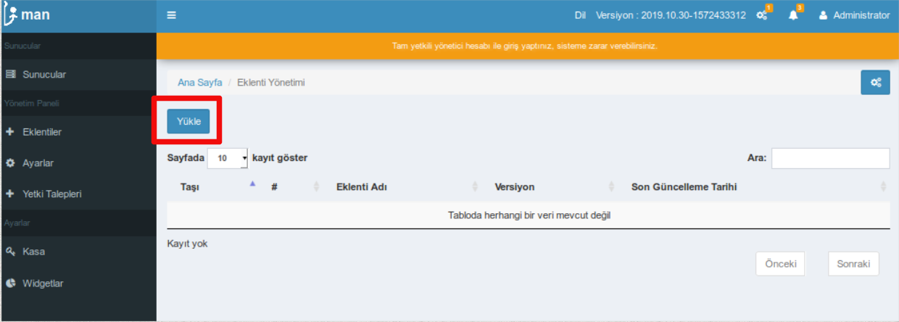
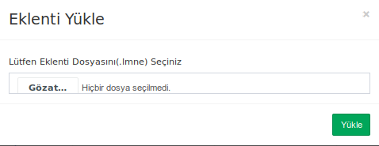
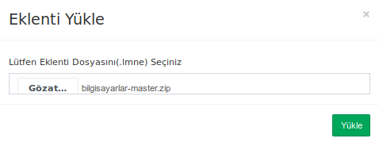
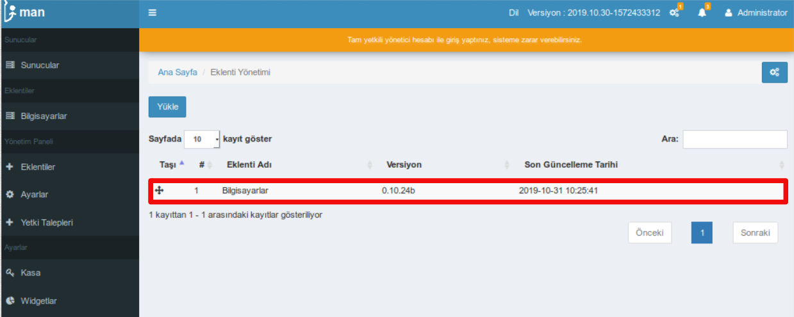

# Liman'a Eklenti Kurulumu ve Güncellenmesi

## 6 Adımda eklenti yükleme ve güncelleme

1. Yönetim panelindeki eklentiler sayfası ile işlem yapabilmeniz için eklentiler kısmına tıklayınız.

2. Eklentiler sayfası açıldığında aşağıdaki ekranla karşılaşmalısınız.

3. Yükle butonuna tıklayınız.

4. Yükle butonuna tıklandığında eklenti yükle açılır penceresi ekrana gelir.

5. Bilgisayarınızda bulunan eklenti seçilir ve Yükle butonuna tıklanır.

6. Yükle butonuna tıklayarak eklentiyi yüklediniz ve sayfa yenilendiğinde eklenti sayfasına gidilir. Yüklediğiniz eklentiyi sayfada görmeniz gerekir.

> Bu şekilde eklentiniz sisteme eklenmiş olacaktır. Güncelleme için de aynı işlemlerin yapılması gerekmektedir. Tüm eklentileri yüklemek için bu işlemler geçerlidir.

