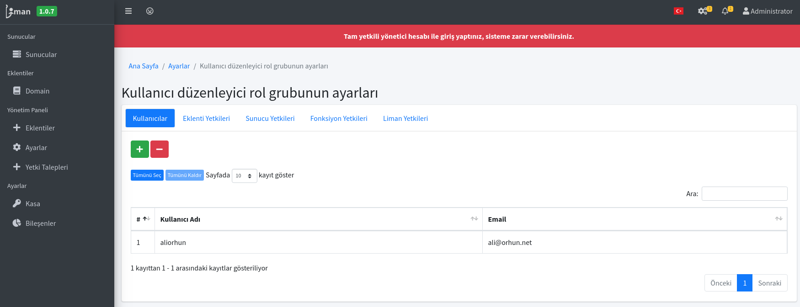

# Liman Yetki Yönetimi

Liman MYS üzerinde kullanıcıları ve kullanıcıların rol gruplarına çeşitli yetkiler verebilirsiniz. Bu yetkiler ile kullanıcılar sunucuları ve istemcileri kısıtlı ve güvenli şekilde yönetebilmektedir.

Yetkileri sistem yöneticisi olan kullanıcılara vermek, daha sonra yönetici olarak Liman'ın yöneticisini zorlayacaktır. Bu nedenle olabildiğince **Rol Grupları** üzerinden yetkiler verilmesi gerekmektedir. Bu nedenle aşağıdaki gibi farklı yetkiler için farklı grupları belirlemeniz _verimli_ ve _güvenli_ olacaktır. 

Örnek olarak bir kullanıcının sadece okuma yapmasını istiyorsanız, Liman MYS üzerinde sadece okuma işlemlerini yapacağı fonksiyonlara izin verip, düzenleme yetkisini farklı bir rol grubuna verebilirsiniz.

Daha sonra Rol grupları içerisine farklı kullanıcıları ekleyip çıkartabilirsiniz. Bu sayede daha düzenli bir yönetim sağlanabilmektedir.

