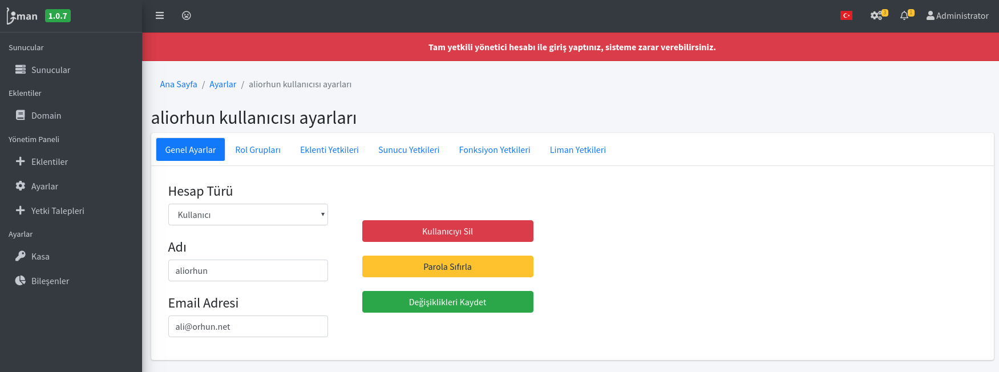
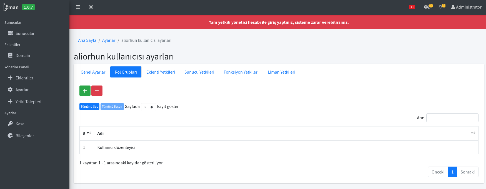
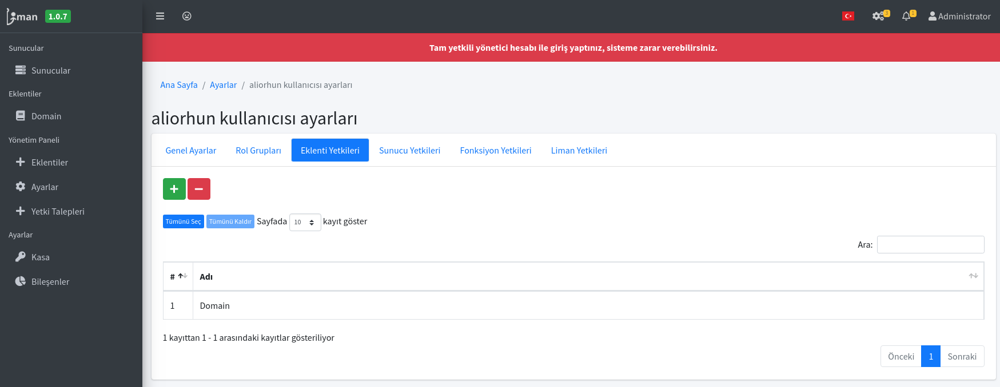
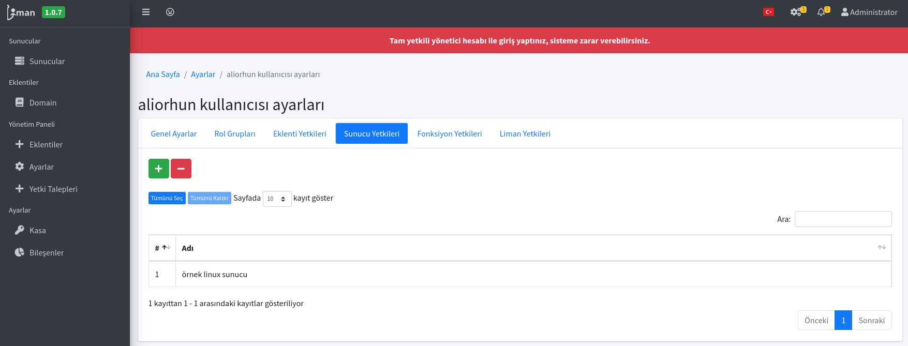
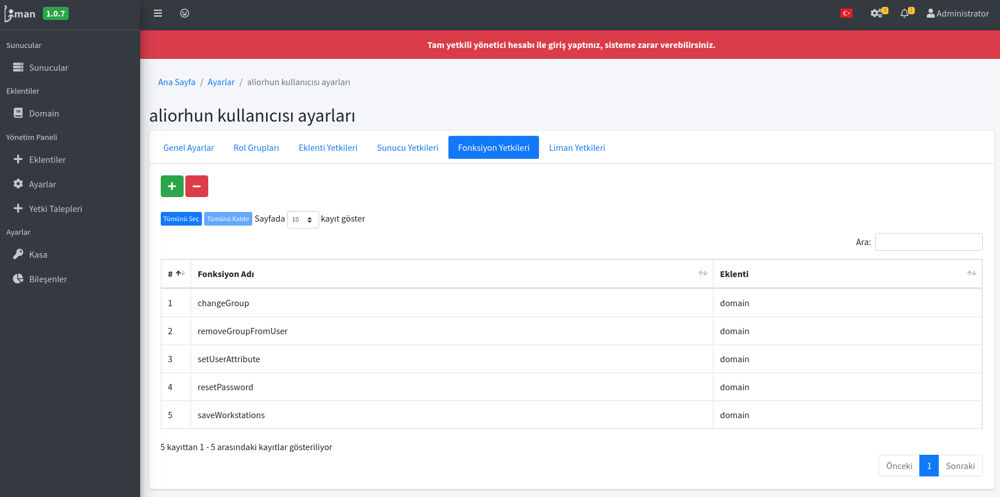
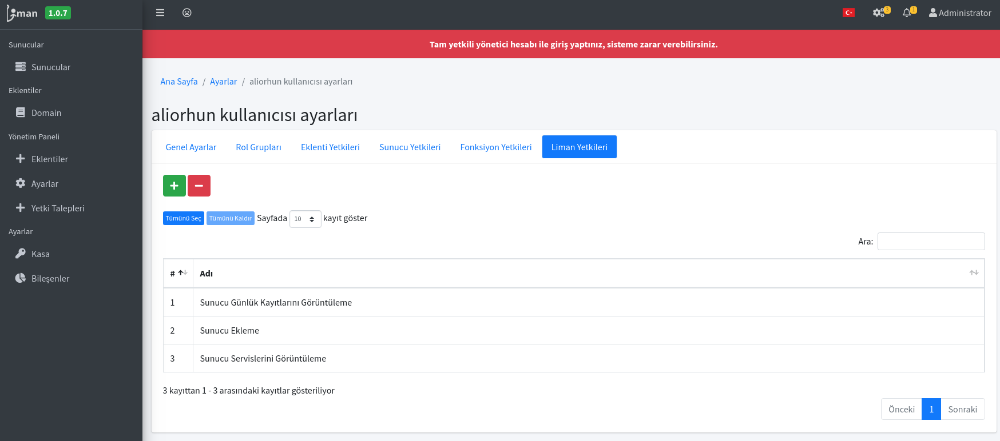

# Liman Kullanıcı Ayarları

Liman MYS üzerinde kullanıcı ayarları aşağıdaki başlıklarda incelenebilir:

* Genel Ayarlar
* Rol Grupları
* Eklenti Yetkileri
* Sunucu Yetkileri
* Fonksiyon Yetkileri
* Liman Yetkileri

## Genel Ayarlar

## Rol Grupları

## Eklenti Yetkileri

## Sunucu Yetkileri

## Fonksiyon Yetkileri

## Liman Yetkileri

