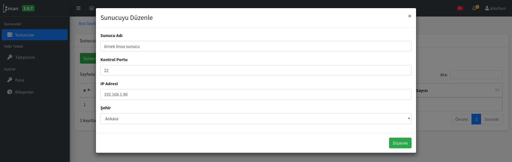
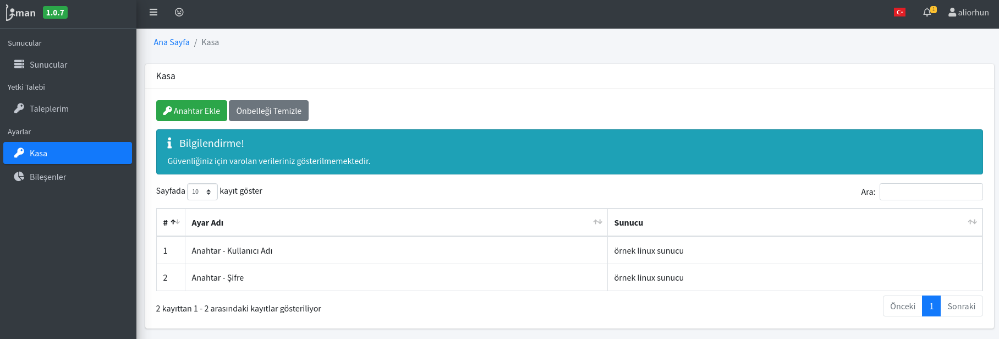

# Sunucu Ayarlarının Düzenlenmesi

Ekli olan bir sunucunun ayarlarının düzenlemesi için farklı yapılar bulunmaktadır.

## Sunucu Genel Bilgilerinin düzenlenmesi

Sunucular sayfasında Sunucu'ya sağ tıklayıp düzenle denildiğinde "Sunucu Adı", "Kontrol Portu", "IP adresi" ve "Şehir" bilgileri düzenlenebilmektedir.

## Sunucu güvenlik verilerinin düzenlenmesi

Sunucu ile ilgili güvenlik verileri "Kasa" ayarları kısmında tutulmaktadır. Kullanıcı adınız ve parolanız bu kısımda tutulmaktadır. Güvenlik nedeniyle düzenlenme izin verilmemektedir fakat "yeni" bir değer ile güncellenebilmektedir. Bunun için Anahtar bilgilerine sağ tıklayarak "Güncelle" demeniz ve yeni değeri girmeniz yeterlidir.

