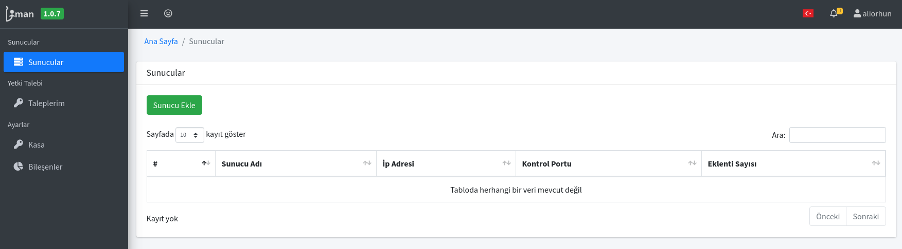
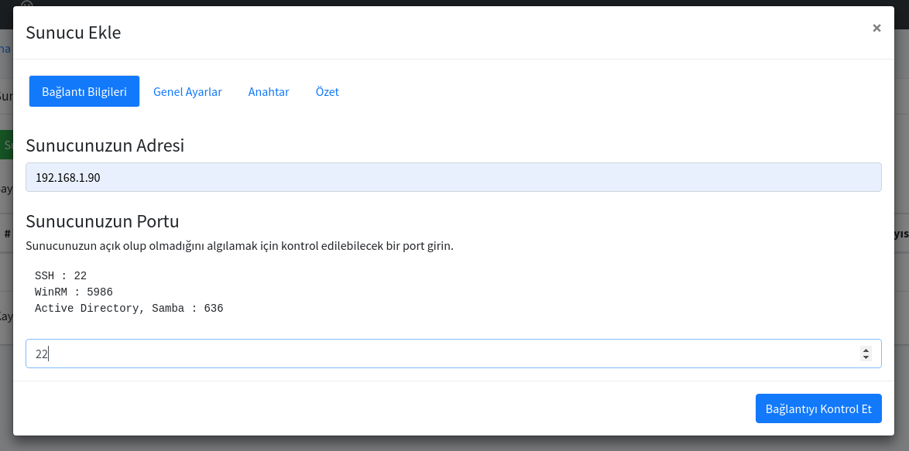
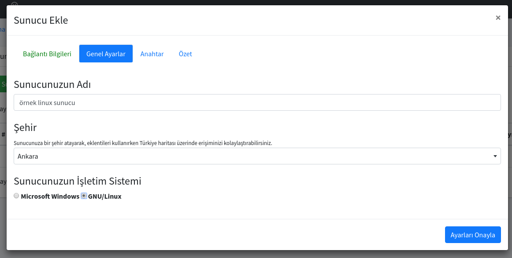
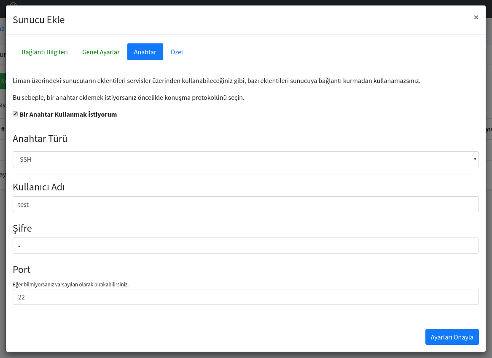
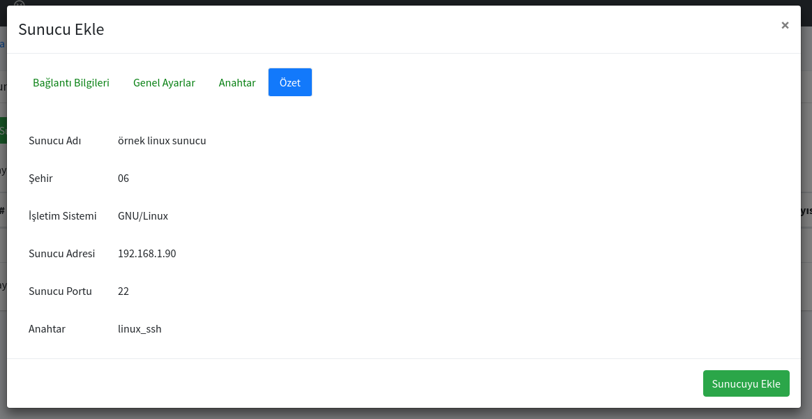
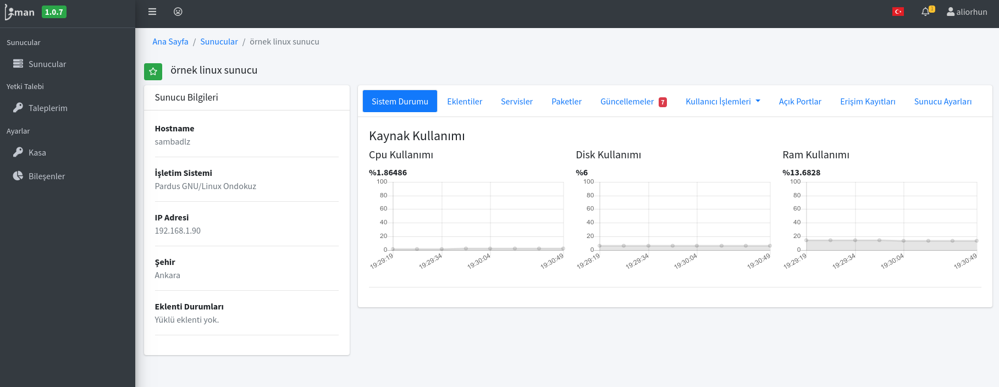

# Sunucu Ekleme ve Kaldırma

Liman MYS üzerinde Sunucu ekleme yetkisine sahip bir kullanıcı iseniz Liman MYS'nin yönetebileceği bir sunucu ekleyebilirsiniz. 

## 1. SSH protokolü ile yönetilen sunucu ekleme

SSH protokolü ile yönetmek istediğiniz sunucuyu ekleyebilmek için aşağıdaki adımları uygulamanız gerekmektedir.

1. Sunucular sayfasında Sunucu Ekle butonuna tıklayınız.

2. Açılan ekranda ulaşacağınız Sunucunun IP adresi veya DNS kaydındaki adresini yazmanız gerekmekte. Ve eğer SSH protokolünü 22 portundan kullanıyorsanız 22 yazmanız gerekmektedir. Fakat güvenlik endişesiyle 22 portunu değiştirmişseniz bu kısmı da düzenlemeniz gerekmektedir. "Bağlantıyı Kontrol Et" diyerek ilgili porttan ağ erişimi bulunmakta ise bir sonraki adıma geçebilirsiniz.

3. Sunucunuza Liman MYS üzerinde hangi ismi vermek istediğiniz ve herhangi bir şehir altında gözükmesini istiyorsanız o şehri yazabilirsiniz. Ve son olarak da sunucunuzun işletim sistemini Microsoft Windows veya GNU/Linux olarak seçmeniz beklenmektedir. "Ayarları Onayla" diyerek bir sonraki adıma geçebilirsiniz.

4. Bu adımda giriş yapabilmeniz için gerekli bilgileri yazmanız gerekmektedir. Anahtar türü olarak SSH ve SSH anahtarını seçebilirsiniz. Eğer anahtar ile giriş yapmak istiyorsanız SSH anahtarını seçebilirsiniz. Rehber dahilinde kullanıcı adı ve parola girecek şekilde giriş yapmayı seçiyoruz ve "Ayarları Onayla" diyerek ilerliyoruz.

5. Bu kısma kadar düzgün şekilde gelebildiyseniz özet bilgilerine bakarak "Sunucuyu Ekle" diyerek onaylayabilirsiniz.

6. Sunucu eklendikten sonra Sunucular sayfası içerisinden giriş yaptıktan sonra aşağıdaki gibi sunucunuzun görülmesi gerekmektedir.

