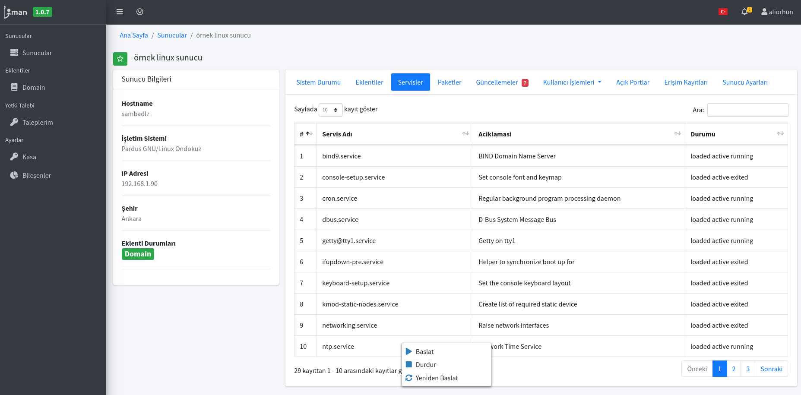
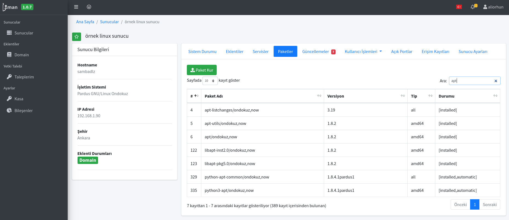
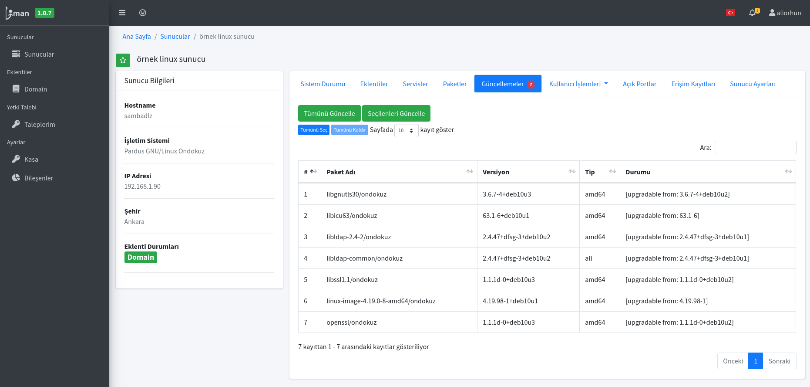
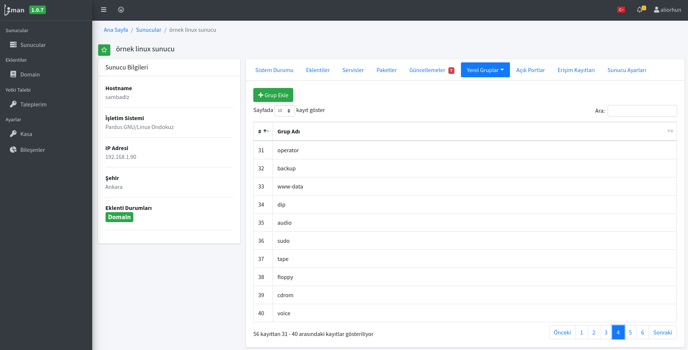
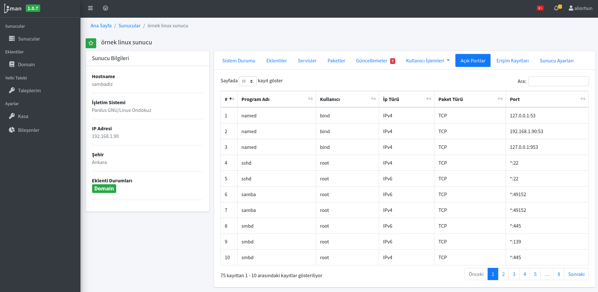

# Sunucu Yönetimi

Temel olarak sunucularda aşağıdaki işlemler yapılabilmektedir.

## Servislerin listelenmesi ve kontrol edilmesi

## Paketlerin listelenmesi ve kontrol edilmesi

## Güncelleme kontrolleri

## Yerel kullanıcı-gruplar

## Sistemde kullanılan portlar

