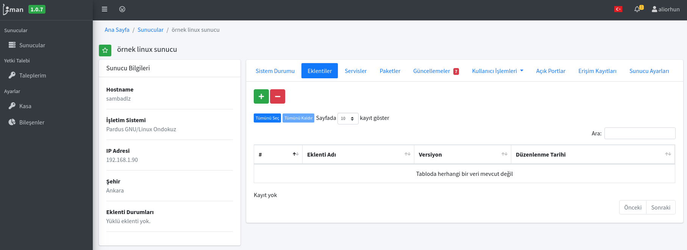
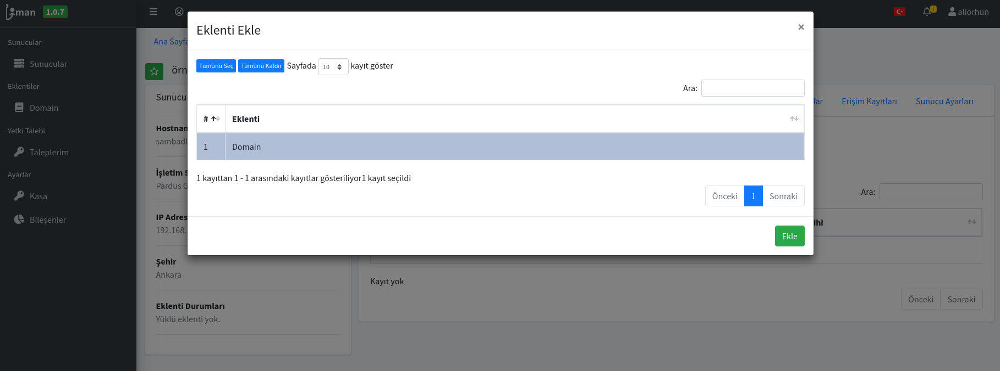
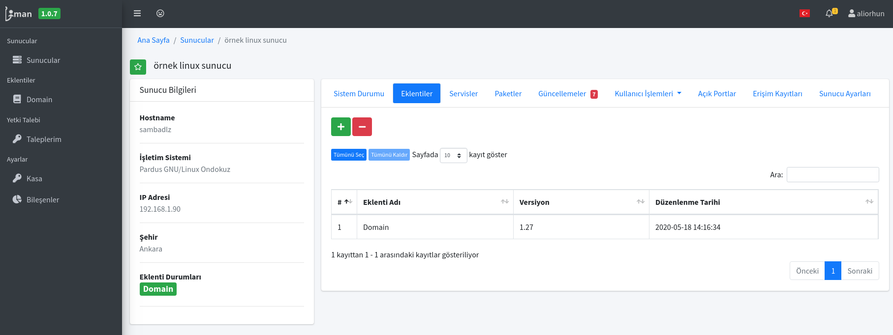
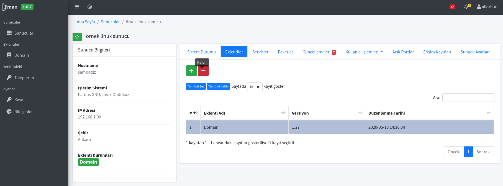

# Sunucu'da Eklenti Kullanılması

## 1. Sunucuya Eklenti Ekleme

Sunucuya, herhangi bir eklenti ekleme yetkiniz bulunuyorsa Sunucu üzerinde Eklentiler sekmesi altında yeni eklenti ekleyebiliyorsunuz.

1. Sunucu sayfasına girdikten sonra Eklentiler sekmesi altındaki yeşil "+" butonuna tıklayarak yetkiniz olan eklentiler listesini görebilirsiniz.

2. Açılan sayfada yetkiniz olan eklentilerden talep ettiklerinizi tekli veya çoklu olarak seçebilir, seçtikten sonra "Ekle" butonuna tıklayarak sunucuyu yönetmek için gerekli eklentiyi aktif etmiş olursunuz.

3. Eklenti eklendikten sonra Sunucu sayfasında Eklentiler sekmesinde ve özet yankısımda Eklenti Durumları altında yeşil olarak eklentinin adı yazması gerekmektedir. İlgili eklentiye bu yeşil butona tıklayarak gidebilirsiniz.

4. Eğer eklenti üzerinde gri veya kırmızı ibareler görüyorsanız sunucunun ilgili eklentiyi çalıştıracak özellikleri olmaması veya ağ bağlantısı olarak erişememesi gibi nedenler olabilmektedir. Bu gibi süreçler için kurumsal destek alınması gerekmektedir.

## 2. Sunucudan eklenti kaldırılması

Sunucu sayfasına girdikten sonra Eklentiler sekmesi altında kaldırmak istediğiniz eklentiyi seçip, üst kısımda kırmızı renkli "-" butonuna tıklayarak, "Seçili eklentileri silmek istediğinizden emin misiniz?" sorusuna "Eklentileri Sil" onayını vererek sunucuyu yönetecek eklentileri silebilirsiniz.

